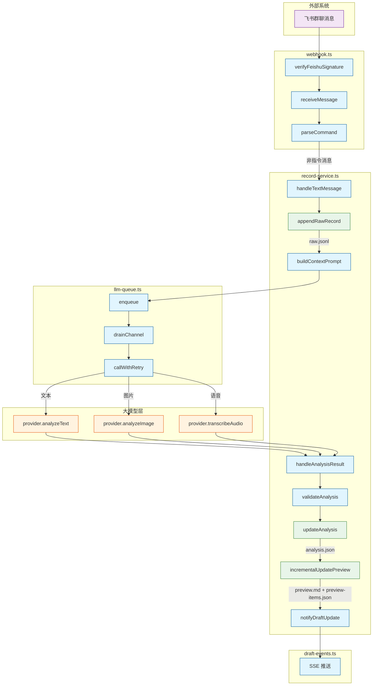
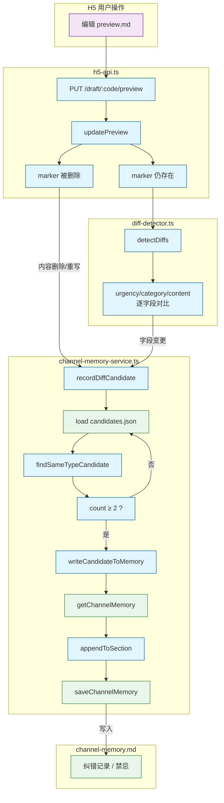
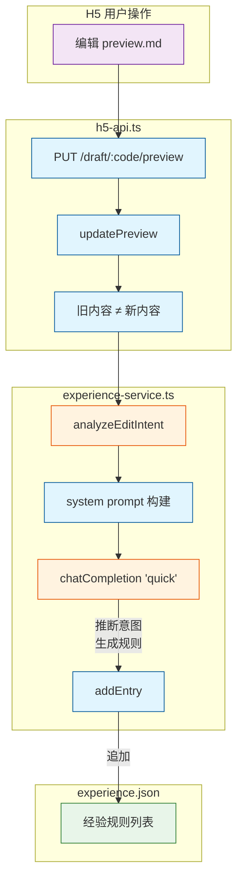
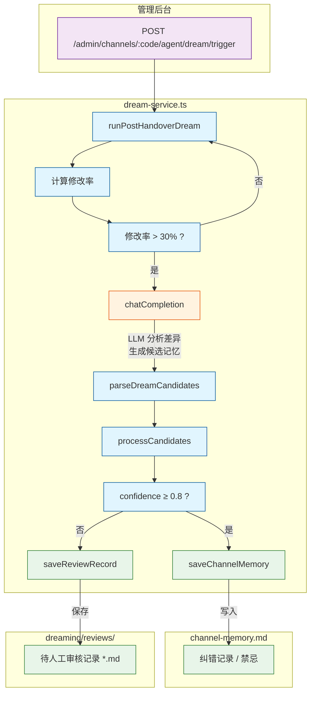
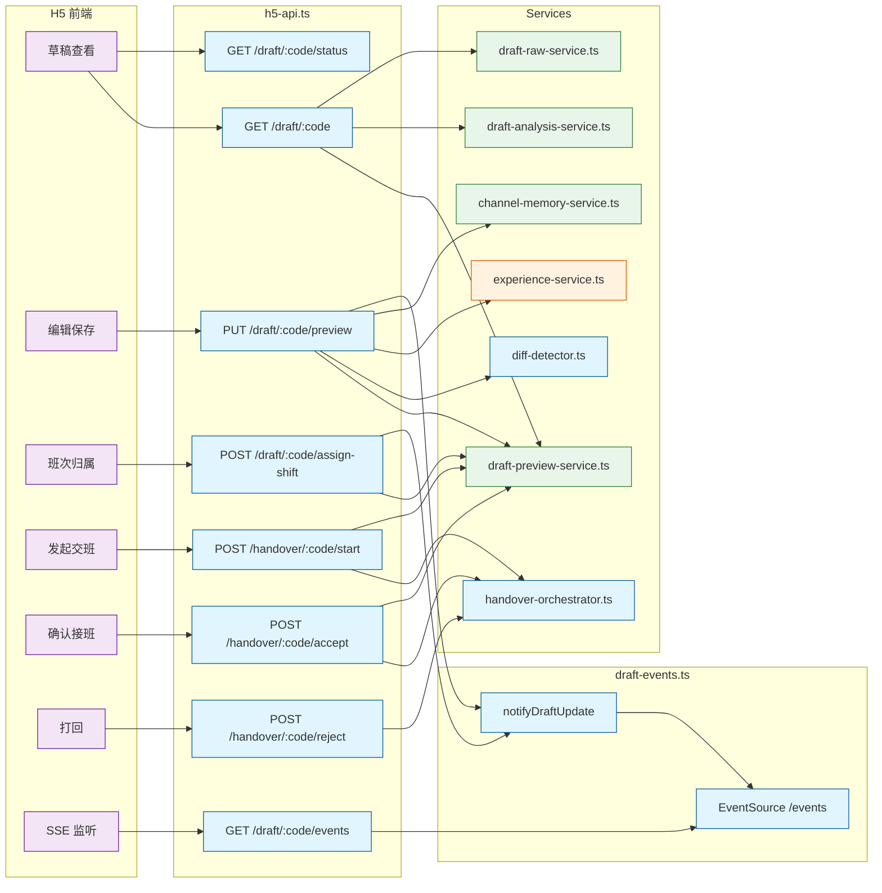

# 业务流流程图 — All Your Handover

> **目的**：用可视化流程图描述各核心业务流程，明确区分**代码逻辑**与**大模型处理**。与 `PARADIGM.md` 配合使用 — `PARADIGM.md` 描述架构哲学与模块边界，本文档描述业务流程中的调用链路。
>
> **图例**：
> - <span style="display:inline-block;width:12px;height:12px;background:#e1f5fe;border:1px solid #01579b;margin-right:4px;"></span> **代码逻辑** — 纯代码执行
> - <span style="display:inline-block;width:12px;height:12px;background:#fff3e0;border:1px solid #e65100;margin-right:4px;"></span> **大模型处理** — LLM 调用（`provider.analyzeText` / `chatCompletion` 等）
> - <span style="display:inline-block;width:12px;height:12px;background:#e8f5e9;border:1px solid #2e7d32;margin-right:4px;"></span> **数据/文件** — 文件读写或 JSON/Markdown 存储
> - <span style="display:inline-block;width:12px;height:12px;background:#f3e5f5;border:1px solid #6a1b9a;margin-right:4px;"></span> **外部系统** — 飞书 IM、H5 前端等

---

## 一、随手记流程

> 飞书群聊消息 → 接收 → 分析 → 更新草稿预览 → SSE 推送



**关键说明**：
- `buildContextPrompt()` 每次注入 soul + agents + channel-memory(纠错记录/禁忌) + experience(规则)
- `llm-queue.ts` 每渠道 FIFO + 全局信号量（并发 3，2 次重试）
- 消息撤回 → `handleMessageRecalled()` → raw.jsonl 追加 tombstone → analysis 标记 recalled → 从 preview 移除

---

## 二、交接流程

> 群聊指令发起 → H5 页面确认/打回 → 归档或取消

```mermaid
flowchart TD
    subgraph Feishu["飞书群聊"]
        CMD[@自己 交班]:::external
    end

    subgraph Webhook2["webhook.ts"]
        H1[HANDOVER_START 指令]:::code
    end

    subgraph Orchestrator["handover-orchestrator.ts"]
        O1[handleHandoverStart]:::code
        O2[readPreview]:::data
        O3[findPending]:::data
        O4[completenessCheck]:::code
        O5[savePending]:::data
        O6[handleHandoverAccept]:::code
        O7[identityCheck]:::code
        O8[buildHandoverRecord]:::code
        O9[saveHandoverRecord]:::data
        O10[clearDraftData]:::data
        O11[handleHandoverReject]:::code
        O12[removePending]:::data
    end

    subgraph H5API["h5-api.ts"]
        A1[POST /handover/:code/start]:::code
        A2[POST /handover/:code/accept]:::code
        A3[POST /handover/:code/reject]:::code
    end

    subgraph H5["H5 移动端"]
        H5A[点击 确认接班]:::external
        H5B[点击 打回]:::external
    end

    subgraph Card["飞书卡片"]
        C1[发送交接卡片含 H5 链接]:::external
        C2[发送完成确认卡片]:::external
        C3[发送打回通知]:::external
    end

    CMD --> H1
    H1 --> O1
    O1 --> O2
    O2 --> O3
    O3 -->|无待交接| O4
    O4 -->|通过| O5
    O5 -->|pending.json| C1
    C1 --> H5A
    C1 --> H5B
    H5A --> A2
    A2 --> O6
    O6 --> O7
    O7 -->|Mode A: 确认人 ≠ 交班人<br/>Mode B: 确认人 = 交班人| O8
    O8 --> O9
    O9 -->|handovers/YYYY-MM/*.md| O10
    O10 -->|writeHandoverBoundary<br/>clearAnalysis<br/>clearPreview| O12
    O12 --> C2
    H5B --> A3
    A3 --> O11
    O11 --> O12
    O12 --> C3

    classDef code fill:#e1f5fe,stroke:#01579b
    classDef data fill:#e8f5e9,stroke:#2e7d32
    classDef external fill:#f3e5f5,stroke:#6a1b9a
```

**关键说明**：
- 两种模式（`requireAccept=true/false`）均保存 pending.json，均需 H5 确认，不自动归档
- `clearDraftData` 不清空 `raw.jsonl`，仅写入 `handover_boundary` 标记

---

## 三、记忆闭环

> 用户编辑预览 → 检测差异 → 候选累积 → 自动写入渠道记忆



**关键说明**：
- `channel-memory.md` 仅 **纠错记录** 和 **禁忌** 两个 Section 注入 LLM prompt
- 同类 diff 重复 ≥2 次 → 自动写入记忆，无需人工干预
- 写入后的记忆通过 `buildContextPrompt()` 注入下一次 LLM 分析

---

## 四、经验学习

> 用户编辑预览 → LLM 推断编辑意图 → 生成规则 → 写入经验库



**关键说明**：
- `analyzeEditIntent` 比较 LLM 原始输出 vs 用户编辑后的内容，让 LLM 推断"用户为什么改了这里"
- 生成的规则通过 `buildExperiencePrompt()` 注入下一次 LLM 分析

---

## 五、梦境反思

> 交接归档后 → 计算修改率 → LLM 分析差异 → 高置信度自动写入记忆



**关键说明**：
- 当前仅通过 Admin API **手动触发**（`admin-agent.ts:148`）
- 高置信度（≥0.8）自动写入 `channel-memory.md`，低置信度存入 `dreaming/reviews/` 待审核
- 未来可接入 `handleHandoverAccept` 实现全自动触发

---

## 六、H5 交互 API 全景

> H5 移动端与后端的所有 API 调用链路



**关键说明**：
- 读操作（GET draft/status/events）使用 `h5OptionalAuth`（匿名可访问）
- 写操作（PUT preview / POST handover/assign-shift）使用 `h5RequireAuth`（401 拒绝匿名）
- SSE 通过 `notifyDraftUpdate()` 统一触发：LLM 分析完成、预览编辑、班次归属、消息撤回、交接状态变更

---

## 文档层级定位

| 层级 | 文件 | 内容 |
|------|------|------|
| L2 范式 | `PARADIGM.md` | 架构哲学、模块边界、数据流文字描述 |
| **L2 流程** | **`docs/FLOWS.md`** | **本文档 — 业务流程可视化（当前）** |
| L3 决策 | `docs/DECISIONS/` | 每个架构决策的"为什么" |
| L4 规则 | `docs/AI_RULES.md` | 编码风格、禁止模式 |

---

*文件位置：`docs/FLOWS.md`*
